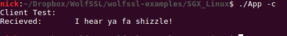

# wolfSSL Linux Enclave Example

Note: This README file is modified version of the README from wolfssl-example's git repository. If you are interested in reading the original README, please visit their repo.

This folder contains an example application, written in C, which demonstrates how to link with the wolfSSL lightweight SSL/TLS library with a simple Enclave using Linux. The example has been tested with Ubuntu 16.04.

Note that the example passes pointers using [user_check]. For more information
about what [user_check] is, and precautions needed when developing an application
that uses it, see Intel documentation located here
https://software.intel.com/en-us/sgx-sdk-dev-reference-attribute-user-check. An
application could be developed to completely avoid passing the WOLFSSL_CTX
pointer between trusted and untrusted code for more security. We will not grade you on passing the WOLFSSL_CTX pointer for this exercise.

## Prerequisites

First create the trusted static wolfssl library from `<wolfssl-root>/IDE/LINUX-SGX`. Steps for creating the static library can be found in `<wolfssl-root>/IDE/LINUX-SGX/README.md` Please refer to the MP3 documentation for detailed information.

## Build

After creating the static library, build the example untrusted application using make. For make the user should specify:
1. Specify SGX Mode to HW

	`SGX_MODE=HW`


2. Specify SGX Debug to 1.

    `SGX_DEBUG=1`

3. The location of the prebuilt static library (this will probably point to `<wolfssl-root>/IDE/LINUX-SGX`)

    `SGX_WOLFSSL_LIB=[location/to/libwolfssl.sgx.static.a]`

4. The location of wolfssl root directory for the header files.

    `WOLFSSL_ROOT=[location/to/wolfssl_root]`

With these three options, simply call, for example:

```make SGX_MODE=HW SGX_WOLFSSL_LIB=~/wolfssl/IDE/LINUX-SGX/ WOLFSSL_ROOT=~/wolfssl SGX_DEBUG=1 ```

### Expected Output


## Running
After building, the user can specify one of a set of options to be run via the command line. For the purpose of the MP, you should only use two flags which are:

* -c: Run a TLS Client in an enclave
  * This option runs an example TLS client in enclave to connect to a server on port 11111. Please change the port to your designated port for this MP.
* -s: Run a TLS Server in an enclave
  * This option runs an example TLS server in enclave to receive clients on port 11111. Please change the port to your designated port for this MP.

To test the enclave client against the enclave server:

### First, start the enclave server.
    ./App -s

### Then, start the enclave client
    ./App -c

This will connect an enclave client, in one enclave, to an enclave server, in a second enclave. These can also be replaced by the wolfssl example client/server. For example, to test a standard client against an enclave server, start the enclave server and then run <wolfssl-root>/examples/client/client.

### Expected Output




## Limitations

1) Single Threaded

2) No Filesystem

3) Untrusted Code Must Load Private Key/Certificate Chain